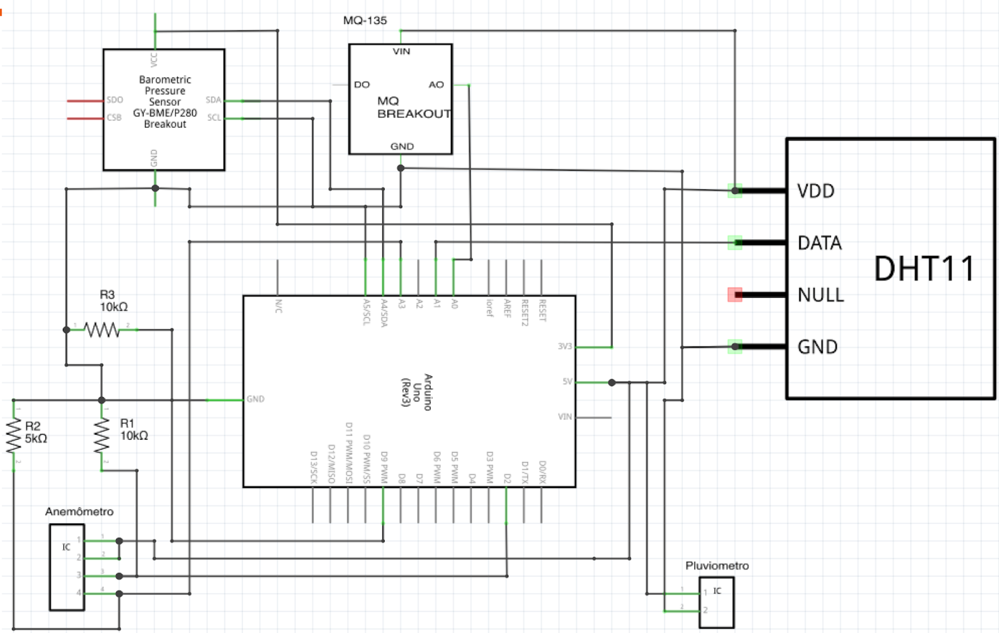
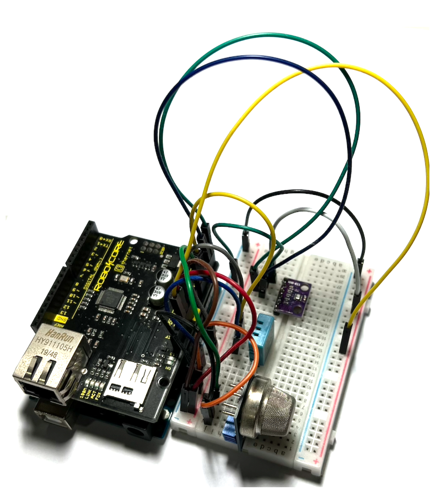
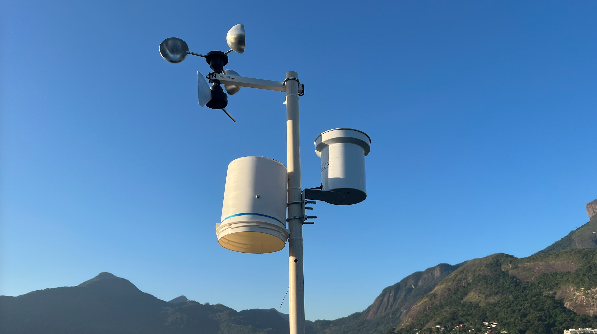
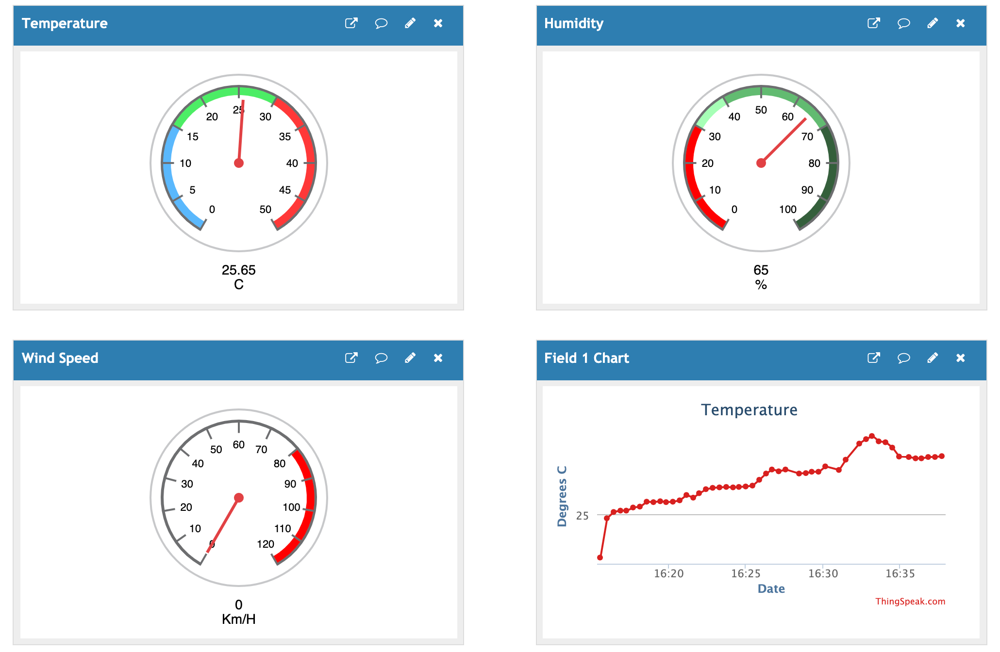

# Weather-Station

## What is this project about?

This is a home-made weather-station built with [Arduino UNO](https://store.arduino.cc/usa/arduino-uno-rev3) that outputs its readings to [ThingSpeak](https://thingspeak.com/).

## What components does it use?

* [Arduino Shield - Ethernet W5500](https://www.robocore.net/shields-arduino/arduino-shield-ethernet-w5500/)
* [MQ135 Module - Toxic Gases Sensor](https://www.robocore.net/sensor-gas/modulo-sensor-de-gases-toxicos-mq-135/)
* [BMP280 - Pressure and Temperature Sensor](https://www.robocore.net/sensor-ambiente/sensor-de-pressao-e-temperatura-bmp280/)
* [DHT11 - Temperature and Humidity Sensor](https://www.robocore.net/sensor-ambiente/sensor-de-temperatura-dht11/)
* [Anemometer / Wind Direction Indicator](https://produto.mercadolivre.com.br/MLB-793398839-anemmetro-c-indicador-dir-vento-biruta-eletrnico-arduino-_JM?quantity=1)
* [Rainmeter](https://produto.mercadolivre.com.br/MLB-724251088-pluvimetro-automatico-p-estaco-meteorologica-arduino-pic-_JM?quantity=1&variation_id=19099732822)
* [400 pins protoboard](https://www.robocore.net/protoboard/protoboard-400-pontos/)

## Electrical Schematic

  

## Board Overview

  

## Final Prototype

  

## Where does it output data to?

This weather-station outputs its data to the ThingSpeak website under its own private channel:
<https://thingspeak.com/channels/1132371>

  

## Contributing

Please feel free to send any feature Pull Request or open Issues!
